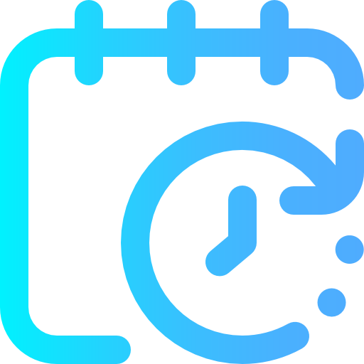

# DeepFocus - Pomodoro Timer

[](./README.md)

<div align="center">
  
  <p><em>Maximize your productivity and focus</em></p>
</div>

## 📋 About

DeepFocus is a modern Pomodoro timer application that helps you better focus on your tasks through timed work cycles and breaks. Developed with modern technologies like Next.js and Tailwind CSS, it offers a pleasant user experience with an elegant design and customizable features.

The Pomodoro Technique is a time management method that uses alternating periods of focused work and breaks to improve mental productivity and reduce fatigue.

## ✨ Features

- 🕰️ **Customizable Cycles**: Adjust focus, short break, and long break times according to your needs
- 🔄 **Automatic Transition**: Option to automatically switch between focus and break cycles
- 📱 **Focus Mode**: Minimalist interface for maximum concentration
- 🌓 **Modern Design**: Elegant dark interface with gradients and animated particles
- 🔔 **Notifications**: Configurable sound alerts at the end of each cycle
- 🌎 **Multilingual**: Full support for Portuguese and English
- ⌨️ **Keyboard Shortcuts**: Quick control through hotkeys
- 📊 **Cycle Tracking**: View your progress in work cycles
- 🔍 **Fullscreen Mode**: Eliminate distractions and focus only on the timer
- 💾 **Persistence**: Your settings are automatically saved

## 🛠️ Technologies

- **[React 18](https://reactjs.org/)**: JavaScript library for building interfaces
- **[Next.js 13.5](https://nextjs.org/)**: React framework for web applications
- **[Tailwind CSS](https://tailwindcss.com/)**: CSS framework for rapid and responsive design
- **[Framer Motion](https://www.framer.com/motion/)**: Library for fluid animations
- **[LocalStorage API](https://developer.mozilla.org/en-US/docs/Web/API/Window/localStorage)**: For user data persistence

## ⌨️ Keyboard Shortcuts

| Key      | Function                        |
|----------|----------------------------------|
| Space    | Start/Pause the timer           |
| R        | Reset the current cycle         |
| N        | Skip to the next cycle          |
| S        | Open/Close settings             |
| F        | Enter/Exit fullscreen mode      |
| M        | Activate/Deactivate focus mode  |
| H        | Open onboarding tutorial        |
| ESC      | Close open modals               |

## 🚀 Getting Started

These instructions will allow you to get a copy of the project running on your local machine for development and testing purposes.

### Prerequisites

- Node.js (version 14.x or higher)
- npm or yarn

### Installation

```bash
# Clone the repository
git clone https://github.com/your-username/deep-focus.git
cd deep-focus

# Install dependencies
npm install
# or
yarn install

# Start the development server
npm run dev
# or
yarn dev
```

Access `http://localhost:3000` in your browser to see the application running.

### Building for production

```bash
# Generate the production build
npm run build
# or
yarn build

# Start the production server
npm start
# or
yarn start
```

## 🧪 Tests

```bash
# Run tests
npm run test
# or
yarn test
```

## 🧑‍💻 Author

**Raul Lize** - [Github](https://github.com/Raullize) - [Portfolio](https://raul-lize-portfolio.vercel.app)

## 🙏 Acknowledgements

- Thank you to everyone who uses this application to improve their productivity
- Inspired by the [Pomodoro Technique](https://francescocirillo.com/pages/pomodoro-technique) created by Francesco Cirillo 